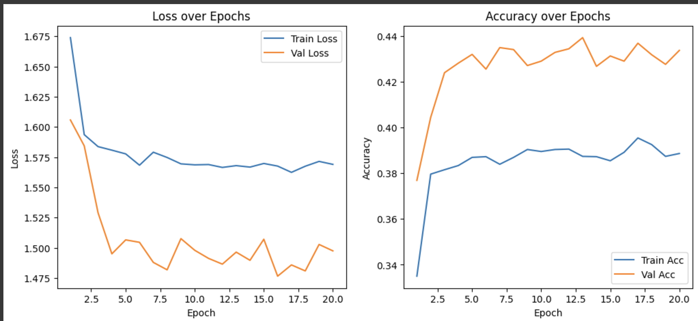
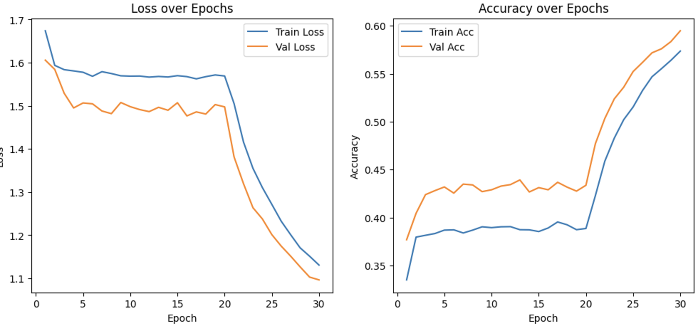
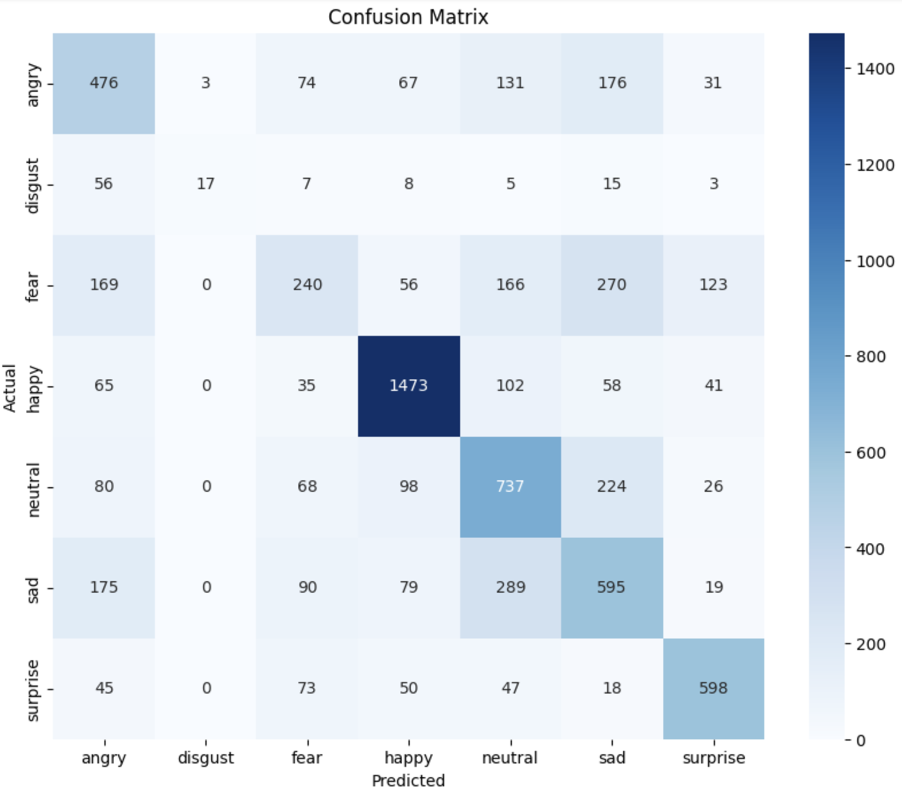
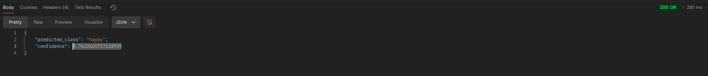

# Building an API for detecting Facial Emotion using FastAPI and PyTorch

## Installation

 Using Conda and `environment.yml`

This method ensures all dependencies, including those installed via Conda and `pip`, are set up correctly.

Please install minconda or anaconda prior to this. Alternatively you can use the requirement.txt file to create a separate environment.

1. **Clone the Repository:**

```bash
git clone https://github.com/TappingWater/facial-emotion-recognition-webcam.git
cd facial-emotion-recognition-webcam
conda env create -f environment.yml
conda activate emotion_recognition
```

1. **Running the Application:**

```bash
python main.py
```

## Research

## Scalable Real-Time Emotion Recognition using EfficientNetV2 and Resolution Scaling {#scalable-real-time-emotion-recognition-using-efficientnetv2-and-resolution-scaling .unnumbered}

### Base Model: EfficientNetV2 {#base-model-efficientnetv2 .unnumbered}

EfficientNetV2 was chosen as the base model as it has a lower
computational cost and performs well on a variety of different datasets.
In addition, the model has low inference times and therefore is a great
option for a real time solution. \[1\]

### Key Techniques

**a. Resolution Scaling**

-   Adjust input resolution to improve accuracy.

-   More flexibility makes it easier to use on different hardware.

**b. Data Augmentation**

-   Prior to training images were rotated, flipped, etc: to simulate
		real world conditions.

**c. Training Setup**

-   Used pre-trained image-net weights to accelerate training.

-   Optimized with the Adam optimizer and a dynamic learning rate.

-   Models trained for 120 epochs on the KDEF dataset.

### Key Points

-   **Real-time Execution:** Real time inference time was determined to
		be 40 ms.

-   **Scalability:** Resolution scaling maintained performance across
		hardware with varying computational capabilities. It was
		successfully tested on an Intel-I5 processor.

## Real-Time Emotional Analysis from A Live Webcam Using Deep Learning

### Base Models: MTCNN and VGG-16 

MTCNN was used for face detection while VGG-16 was used for facial
emotion recognition classification. \[2\]

### Key Techniques

**a. Face Detection and Alignment**

-   Utilized MTCNN to accurately detect and align faces in live webcam
		feeds.

-   Ensured consistent face positioning to improve classification
		accuracy.

**b. Feature Extraction and Classification**

-   Employed VGG-16 for extracting deep features from facial images.

-   Applied Transfer Learning to fine-tune the pre-trained VGG-16 model
		on the FER2013 dataset.

**c. Real-Time Implementation**

-   Integrated OpenCV for capturing and processing live video streams.

-   Achieved real-time emotion recognition by optimizing the processing
		pipeline.

### Key Points {#key-points-1 .unnumbered}

-   **High Training Accuracy:** Achieved 97.23% accuracy on the training
		set, demonstrating effective learning of facial emotion patterns.

-   **Real-Time Performance:** Successfully implemented a system capable
		of processing live webcam feeds and displaying emotion
		classifications in real-time.

-   **Hybrid Model Efficiency:** Combining MTCNN and VGG-16 provided a
		balanced trade-off between speed and accuracy, suitable for
		real-world applications.

-   **Applicability:** Potential applications include patient
		monitoring, security surveillance, and e-learning environments.

# Datasets

### FER2013 Dataset

Based on our findings, we chose to work with the FER-2013 dataset due to
its terms of service and availability. The FER2013 dataset consists of
grayscale images of faces, sized at 48x48 px. Faces are categorized into
one of 7 discrete emotional states:

-   0 = Angry

-   1 = Disgust

-   2 = Fear

-   3 = Happy

-   4 = Sad

-   5 = Surprise

-   6 = Neutral

The dataset is divided into two main subsets:

-   **Training Set:** 28,709 examples

-   **Public Test Set:** 3,589 examples

### Other Notable FER Datasets

The FER-2013 dataset is readily available online and the dataset is
relatively small making it an ideal option for small lightweight models.

**1. CK+ (Extended Cohn-Kanade):**

-   **Description:** Contains both posed and spontaneous facial
		expressions with detailed action units

-   **Differences from FER2013:** Better option for dynamic emotional
		analysis in comparison to the static images available in FER 2013.

**2. JAFFE (Japanese Female Facial Expression):**

-   **Description:** Comprises 213 images of Japanese female subjects
		displaying seven emotions.

-   **Differences from FER2013:** Dataset lack data variety and is
		suitable for specific problems.

**3. AffectNet:**

-   **Description:** Large dataset with 1 million samples that are
		labelled both on the discrete and valence emotion scales.

-   **Differences from FER2013:** Data is annotated more richly with
		more detail

**4. RAF-DB (Real-world Affective Faces Database):**

-   **Description:** 30,000 images collected from the net that are
		labelled according to the 7 basic discrete emotions.

-   **Differences from FER2013:** Dataset simulates real world
		conditions such as different lighting and backgrounds making it a
		harder but more accurate benchmark.

### Considerations on Dataset Size and Image Resolution 

**Model Size and Dataset Size**

-   **Larger Datasets:**

		-   Can support larger and more complex models with several layers
				and parameters.

		-   Larger dataset means a more varied training set and therefore a
				better generalized model.

		-   Requires more computation and training time.

-   **Smaller Datasets:**

		-   Works with smaller models.

		-   Can regain performance through techniques like transfer learning
				and data augmentation.

		-   Good for mobile solutions and when computational resources are
				limited.

**Reasons for Choosing Smaller Datasets**

-   **Resource Constraints:** Used a Google Cloud instance with a T4 GPU
		(16Gb VRAM) for training and a M3 pro to test inference.

-   **Faster Experimentation:** Smaller datasets allow for quicker
		training and iteration during the development and tuning of models.

-   **Availability and Terms of Service**: FER-2013 dataset is readily
		available for download on Kaggle hub and is relatively small.

**Impact of Image Resolution on Model Performance and Data Size**

-   **Higher Pixel Size (Resolution):**

		-   Provides more detailed information and can therefore capture
				more abstract patterns.

		-   Increases the amount of data per image, resulting in larger
				dataset sizes and higher computational and memory requirements.

		-   Increasing resolution means we need more parameters in the input
				layers to caputre the data in each pixel and therefore more
				reousrces.

-   **Lower Pixel Size (Resolution):**

		-   Reduces computational and memory requirements, enabling faster
				training and inference.

		-   May not capture more complex relationships due to lack of data.

		-   Helps in scenarios where bandwidth or storage is limited, making
				it easier to manage and process data.

# Training a PyTorch Model for detecting facial emotions

## Data Preprocessing

Training a PyTorch model for detecting emotions involves several key
steps, starting with data preprocessing. The following outlines the
process and explains the corresponding code used in this project.

### Overview

The code used to train the models for inference in this project can be
found in the repository under `./notebooks/FER_efficientNet.ipynb`. The
FER-2013 dataset was used for training and was downloaded directly from
KaggleHub.

### Data Preprocessing

PyTorch provides built-in functionalities that simplify the
preprocessing required for data augmentation.

		train_transform = transforms.Compose([
			 transforms.Resize((224, 224)),
			 transforms.RandomHorizontalFlip(),
			 transforms.RandomRotation(10),
			 transforms.ToTensor(),
			 transforms.Normalize(mean=[0.485, 0.456, 0.406],
														std=[0.229, 0.224, 0.225])
		])

#### Explanation:

-   **Resize (224, 224):**

		-   Purpose: Resizes each input image to 224x224 pixels.

		-   Reason: EfficientNet and other pre-trained PyTorch models like
				ResNet expect input images of this size. Resizing ensures
				compatibility, enabling the use of transfer learning.

		-   Impact: While resizing grayscale images (48x48) to a larger size
				can lead to pixelation, it allows leveraging the powerful
				feature extraction capabilities of pre-trained models.

-   **RandomHorizontalFlip:**

		-   Purpose: Randomly flips the image horizontally with a default
				probability of 0.5.

		-   Reason: Introduces variability in the training data, helping the
				model generalize better by learning from different orientations
				of the same image.

-   **RandomRotation (10 degrees):**

		-   Purpose: Randomly rotates the image by up to ±10 degrees.

		-   Reason: Enhances data augmentation by making the model robust to
				slight variations in face orientation.

-   **ToTensor:**

		-   Purpose: Converts the PIL Image or NumPy array to a PyTorch
				tensor.

		-   Reason: Neural networks in PyTorch operate on tensors. This
				transformation also scales pixel values from \[0, 255\] to \[0,
				1\].

-   **Normalize (mean and std):**

		-   Purpose: Normalizes the tensor using the specified mean and
				standard deviation for each color channel.

		-   Values:

				-   **Mean**: \[0.485, 0.456, 0.406\]

				-   **Standard Deviation**: \[0.229, 0.224, 0.225\]

		-   Reason: These values are standard for pre-trained models on
				ImageNet. Normalization ensures that the input data has a
				similar distribution to the data the model was originally
				trained on, which can improve convergence and performance.

Since the FER-2013 dataset consists of grayscale images (1 channel), but
EfficientNet expects 3-channel RGB images, the grayscale images are
typically converted to 3 channels by duplicating the single channel.
This conversion allows the grayscale images to be compatible with the
pre-trained EfficientNet architecture without modifying the input layer.

### Dataset Splitting

After defining the transformations, the dataset is split into training,
validation, and test sets to ensure effective training and evaluation.

		# Define the path to the dataset
		fer2013_path = 'fer2013'

		# Create datasets
		train_dataset_full = datasets.ImageFolder(root=os.path.join(fer2013_path, 'train'), transform=train_transform)
		test_dataset = datasets.ImageFolder(root=os.path.join(fer2013_path, 'test'), transform=val_test_transform)

		print(f"Number of training samples (full): {len(train_dataset_full)}")
		print(f"Number of test samples: {len(test_dataset)}")

#### Why Three Separate Sets?

-   **Training Set (22,967 samples):** Used to train the model, allowing
		it to learn the underlying patterns in the data.

-   **Validation Set (5,742 samples):** Used to tune hyperparameters and
		monitor the model's performance during training, helping to prevent
		overfitting.

-   **Test Set (7,178 samples):** Used to evaluate the final model's
		performance on unseen data, providing an unbiased assessment of its
		generalization capabilities.


## Data Loading

		# Define DataLoaders with optimized num_workers
		batch_size = 64
		num_workers = 4
				
		train_loader = DataLoader(train_dataset, batch_size=batch_size, shuffle=True, num_workers=num_workers, pin_memory=True)
		val_loader = DataLoader(val_dataset, batch_size=batch_size, shuffle=False, num_workers=num_workers, pin_memory=True)
		test_loader = DataLoader(test_dataset, batch_size=batch_size, shuffle=False, num_workers=num_workers, pin_memory=True)
				
		print("DataLoaders optimized with increased num_workers and pin_memory.")

The provided code sets up DataLoaders in PyTorch, which are essential
for efficiently handling and feeding data into the neural network during
training, validation, and testing. By defining a `batch_size` of 64, the
DataLoader groups 64 images together into a single batch. This batching
process allows the model to process multiple samples simultaneously,
leveraging parallel computation to speed up training and improve
computational efficiency. The `num_workers` parameter is set to 4,
indicating that four subprocesses will be used to load the data in
parallel. This parallel data loading minimizes the time the GPU spends
waiting for data, ensuring that the training process remains smooth and
uninterrupted. Additionally, `pin_memory=True` is specified, which
enables faster data transfer from the CPU to the GPU by using pinned
(page-locked) memory, further optimizing training speed, especially when
utilizing CUDA-enabled devices.

During training, the model processes each batch of 64 images, performing
forward and backward passes to compute gradients and update the model
parameters accordingly. This means that the model's weights are updated
after every batch, allowing it to learn from the aggregated information
of multiple samples at once. Shuffling is enabled for the training
DataLoader (`shuffle=True`), which ensures that the data is randomized
each epoch, enhancing the model's ability to generalize by preventing it
from learning the order of the data. In contrast, shuffling is disabled
for the validation and test DataLoaders (`shuffle=False`) to maintain
consistency during evaluation, providing a reliable measure of the
model's performance on unseen data.

## Model Definition

``` python
class FER2013Model(nn.Module):
		def __init__(self, num_classes=7, pretrained=True):
				super(FER2013Model, self).__init__()
				self.model = EfficientNet.from_pretrained('efficientnet-b0') if pretrained else EfficientNet.from_name('efficientnet-b0')
				# Replace the classifier
				in_features = self.model._fc.in_features
				self.model._fc = nn.Sequential(
						nn.Dropout(p=0.4),
						nn.Linear(in_features, num_classes)
				)

		def forward(self, x):
				x = self.model(x)
				return x

# Check device
device = torch.device("cuda" if torch.cuda.is_available() else "cpu")
print(f"Using device: {device}")

# Initialize the model
model = FER2013Model(num_classes=7, pretrained=True)
model = model.to(device)

print(model)
```

I defined a custom PyTorch model called the FER2013 model. This class
leverages a pre-trained EfficientNet-B0 model from the
`efficientnet_pytorch` library to take advantage of transfer learning.
By setting the `pretrained` parameter to `True`, the model loads weights
that have been previously trained on the ImageNet dataset, which allows
the model to abstract feature representations learned from a large and
diverse set of images. This significantly accelerates the training
process and improves the model's performance, especially when dealing
with limited datasets like FER-2013. Within the `FER2013Model` class,
the original classifier layer of EfficientNet is replaced with a new
sequential module comprising a dropout layer with a probability of 0.4
and a linear layer that maps the input features to the seven emotion
classes. This modification tailors the pre-trained model to the specific
task of emotion detection by adjusting the final layer to output the
correct number of classes.\

After defining the model architecture, the code checks for the
availability of a CUDA-enabled GPU. CUDA is an API developed by NVIDIA
that lets you use the GPU to accelerate training. Since I used a cloud
instance that utilized a T4 GPU, I was able to leverage CUDA for this
project, significantly speeding up the training.\

## Model Training

``` python
		# Define loss function
		criterion = nn.CrossEntropyLoss()

		# Define optimizer - only parameters of the final layer are being optimized initially
		optimizer = optim.Adam(model.model._fc.parameters(), lr=1e-3)

		def train_epoch(model, loader, criterion, optimizer, device):
				model.train()
				running_loss = 0.0
				correct = 0
				total = 0

				for images, labels in loader:
						images = images.to(device)
						labels = labels.to(device)

						# Zero the parameter gradients
						optimizer.zero_grad()

						# Forward pass
						outputs = model(images)
						loss = criterion(outputs, labels)

						# Backward pass and optimization
						loss.backward()
						optimizer.step()

						# Statistics
						running_loss += loss.item() * images.size(0)
						_, predicted = torch.max(outputs.data, 1)
						total += labels.size(0)
						correct += (predicted == labels).sum().item()

				epoch_loss = running_loss / total
				epoch_acc = correct / total
				return epoch_loss, epoch_acc

		def validate_epoch(model, loader, criterion, device):
				model.eval()
				running_loss = 0.0
				correct = 0
				total = 0

				with torch.no_grad():
						for images, labels in loader:
								images = images.to(device)
								labels = labels.to(device)

								# Forward pass
								outputs = model(images)
								loss = criterion(outputs, labels)

								# Statistics
								running_loss += loss.item() * images.size(0)
								_, predicted = torch.max(outputs.data, 1)
								total += labels.size(0)
								correct += (predicted == labels).sum().item()

				epoch_loss = running_loss / total
				epoch_acc = correct / total
				return epoch_loss, epoch_acc

		num_epochs = 20
		best_val_acc = 0.0

		# Lists to store metrics
		train_losses = []
		train_accuracies = []
		val_losses = []
		val_accuracies = []

		for epoch in range(num_epochs):
				train_loss, train_acc = train_epoch(model, train_loader, criterion, optimizer, device)
				val_loss, val_acc = validate_epoch(model, val_loader, criterion, device)

				train_losses.append(train_loss)
				train_accuracies.append(train_acc)
				val_losses.append(val_loss)
				val_accuracies.append(val_acc)

				print(f"Epoch [{epoch+1}/{num_epochs}] "
							f"Train Loss: {train_loss:.4f} Train Acc: {train_acc:.4f} "
							f"Val Loss: {val_loss:.4f} Val Acc: {val_acc:.4f}")

				# Save the best model
				if val_acc > best_val_acc:
						best_val_acc = val_acc
						torch.save(model.state_dict(), 'best_model.pth')
						print("Best model saved.")
```

The provided code sets up the loss function and optimizer, and defines
the training and validation processes for the emotion detection model.
The loss function used is `CrossEntropyLoss`, which is ideal for
multi-class classification tasks like emotion recognition as it measures
the difference between the predicted class probabilities and the actual
class labels. The optimizer chosen is Adam, an algorithm that adapts the
learning rate for each parameter, enhancing convergence speed and
overall performance. Importantly, the optimizer is configured to update
only the parameters of the final classification layer
(`model.model._fc.parameters()`) initially. This is an application of
transfer learning as we leverage the pre-trained layers in
EfficientNet-B0 based on the ImageNet dataset.\

The `train_epoch` function handles the training process for one epoch.
It sets the model to training mode and initializes counters for running
loss, correct predictions, and total samples. For each batch of images
and labels from the training DataLoader, the data is moved to the
designated device (GPU if available). The optimizer's gradients are
reset to zero to prevent accumulation from previous iterations. The
model performs a forward pass to generate predictions, computes the loss
using the defined criterion, and then performs a backward pass to
calculate gradients. The optimizer updates the model's parameters based
on these gradients. Throughout the epoch, the function accumulates the
loss and counts the number of correct predictions to calculate the
average loss and accuracy at the end of the epoch.\

Similarly, the `validate_epoch` function evaluates the model's
performance on the validation set. It sets the model to evaluation mode
and disables gradient computations to save memory and computational
resources. The function iterates over the validation DataLoader,
performing forward passes to obtain predictions and compute the loss
without updating the model's parameters. It also tracks the total loss
and the number of correct predictions to determine the validation loss
and accuracy.\

I ran this code over 20 epochs which took roughly 2 hours on a T4 cloud
instance. The training loss and accuracy over epochs can be seen below:

{#fig:training_results
width="\\textwidth"}

## Fine-Tuning {#fine-tuning .unnumbered}

After training we can fine-tune the model to further boost performance.
Initially, during the training phase, only the parameters of the final
classification layer were being optimized while the rest of the model's
layers remained frozen.\
In the fine-tuning phase, the code first unfreezes all layers of the
model by setting `param.requires_grad = True` for every parameter in
`model.model.parameters()`. This action allows the entire network to be
trainable, enabling the model to adjust not just the final
classification layer but also the deeper layers to better capture the
specific features relevant to emotion detection in the FER-2013 dataset.
Alternatively, if resources are limited we can unfreeze a discrete
number of layers from the last.\
A new optimizer is then defined using Adam with a significantly lower
learning rate (`lr=1e-5`). The rationale behind using a lower learning
rate during fine-tuning is to make subtle adjustments to the pre-trained
weights without causing large updates that could disrupt the valuable
feature representations already learned. Therefore, a lower learning
rate leads to better stability during fine tuning. The results obtained
after fine tuning are plotted below:



## Results

The model was evaluated using the test dataset, and a confusion matrix
was generated to visualize the performance across different emotion
classes. Additionally, a detailed classification report was produced to
assess precision, recall, and F1-score for each class.

```
		Classification Report:
									precision    recall  f1-score   support

					angry       0.45      0.50      0.47       958
				disgust       0.85      0.15      0.26       111
					 fear       0.41      0.23      0.30      1024
					happy       0.80      0.83      0.82      1774
				neutral       0.50      0.60      0.54      1233
						sad       0.44      0.48      0.46      1247
			 surprise       0.71      0.72      0.72       831

				accuracy                           0.58      7178
			 macro avg       0.59      0.50      0.51      7178
		weighted avg       0.57      0.58      0.57      7178
```

{#fig:confusion_matrix
width="\\linewidth"}

The final model had an accuracy of 58% and performed well in detecting
emotions such as happy and neutral and moderately for sad and surprise.
These results indicate that while the model is effective for certain
emotions, there is significant room for improvement in others. Further
training and fine-tuning could enhance the model's ability to accurately
detect the less well-performing emotions. However, due to limited
computational constraints, this model was chosen as the most viable
option for facial emotion recognition.

## REST API

### Preprocessing generic image files {#preprocessing-generic-image-files .unnumbered}

To create a REST API for detecting emotions using generic images, I
utilized FastAPI, a modern web framework for building APIs with Python.
The API includes an endpoint named `predict`, which accepts image files
uploaded by users. These images can vary widely in size, contain
subjects positioned anywhere within the frame, and exhibit different
levels of zoom, presenting a challenge since the emotion detection model
was specifically trained on centered faces. To ensure that the subject's
face is properly aligned and standardized for accurate emotion
prediction, I integrated Facenet into the preprocessing pipeline.\
Facenet, is known for its robust face detection and alignment
capabilities, and is based on a Multi-task Cascaded Convolutional
Networks (MTCNN) to accurately locate and crop faces within an image,
regardless of their position or scale. This is essential because the
model relies on consistent face positioning to effectively recognize
emotions. Once a face is detected using Facenet, the preprocessing steps
involve converting the cropped face image to grayscale to align with the
training data specifications, as the emotion detection model was trained
on grayscale images. To maintain compatibility with the pre-trained
EfficientNet architecture, the grayscale image is then converted back to
RGB by duplicating the single grayscale channel across all three RGB
channels. This ensures that the image retains its intensity information
while meeting the input requirements of the model.\
Subsequently, the image is resized to 224x224 pixels, the standard input
size for EfficientNet, ensuring that the model can process the image
efficiently during inference.

For  example if our API receives this stock image:


It would be transformed to the following before feeding to our FER model:


A MTCNN, unlike a CNN does more than one thing at a time. It can
identify facial features called landmarks. It is also built in stages
where each stage is refined based on the previous. Each stage is its own
separate neural network forming a cascade.

### Testing with POSTMAN

By combining the two models I was able to generate the API and test with
a few stock images.




## Key Takeaways

Throughout this project, we gained a comprehensive understanding of
Facial Emotion Recognition (FER) by reading relevant research papers. We
learned how to use PyTorch to train models tailored to specific tasks
using a pre-trained model like efficientNet. We learnt about
optimization algorithm like Adam and how it is used during training and
fine tuning. Additionally, We gained insights into pre-processing and
augmenting data and how to fine tune such models for better accuracy.
Utilizing Facenet, We effectively centered faces in images to match the
training data requirements. We also developed a REST API to accept image
files, integrating it seamlessly with the emotion detection model.
Furthermore, We familiarized myself with advanced models such as
EfficientNet, ResNet, and Facenet, understanding their architectures and
applications in FER.

# References

1.  O. Ghadami, A. Rezvanian, and S. Shakuri, \"Scalable Real-time
		Emotion Recognition using EfficientNetV2 and Resolution Scaling,\"
		2024 10th International Conference on Web Research (ICWR), Tehran,
		Iran, 2024, pp. 1-7, doi: 10.1109/ICWR61162.2024.10533360.

2.  C. A. Kumar and K. Anitha Sheela, \"Real-Time Emotional Analysis
		from A Live Webcam Using Deep Learning,\" 2022 3rd International
		Conference for Emerging Technology (INCET), Belgaum, India, 2022,
		pp. 1-5, doi: 10.1109/INCET54531.2022.9824894.
